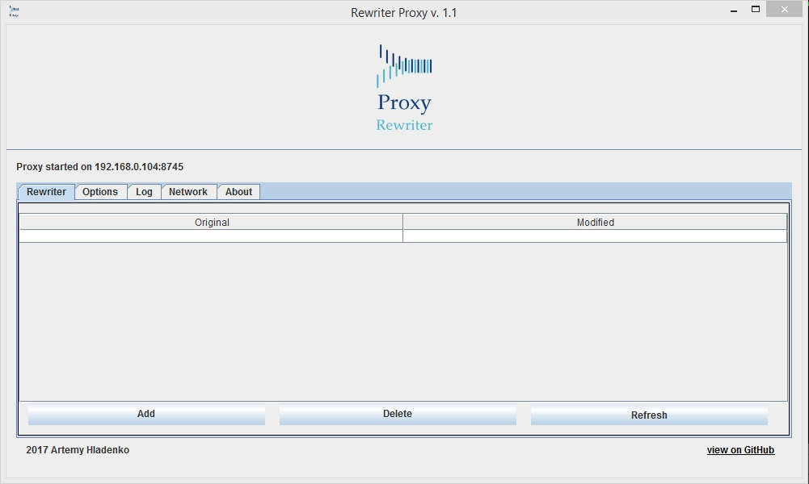

# Rewriter-Proxy-Tool
Proxy tool with user-friendly GUI based on BrowserMobProxy.
 
```$ mvn package``` -- generate executable jar file.

It will appear in target folder with name "RewriterProxy-1.0-SNAPSHOT-jar-with-dependencies".

 

#### Usage:
On start, server shows IP and port, which is used for proxy  
For begin, you need to connect your browser to this IP and port than check it in Log or Network tab.
Default port is 8745, run jar with cmd parameter port:1234 to change it. 

#### Rewriter tab

In this tab you can add filter to request, that you want to rewrite.  
"Original" -- string that contain full or part or original request.  
"Modified" -- string value contain full or part or new request  
When string values used, it will be replace all the original sting in request. If table values contains different domain, "Host" header will be automatically replaced if both "Original" and "Modified" will be beginning with "http" prefix). You may add any mapping values to filter, push "Refresh" button to make it active.

#### Options tab

You can add a chained proxy ip address, add custom headers. Use SSL rule to encrypt secure connection data, this feature will work only if your have been installing ssl certificate to your browser or mobile device. This feature is turned off by default.

#### Log tab

Log out all your browsing history to custom text field, **Requests** marked as ">>", **Responses** as "<<".  
You can easily copy or drag and drop selected text from this field to any text/code editors, email. etc  
Overwritten requests will be marked in new line with UPPERCASE warning message.

#### Network tab

Use this tab to closely look into the requests/responses details. This table contain exactly the same info as in "Log tab" except SSL encrypted requests, if you choose some row, and double-click on it you'll see a details. RewriterProxy based on browsermob-proxy (java distr) [https://github.com/lightbody/browsermob-proxy](https://github.com/lightbody/browsermob-proxy)  

#### License

This program is free software: you can redistribute it and/or modify it under the terms of the GNU General Public License as published by the Free Software Foundation, either version 3 of the License, or (at your option) any later version. This program is distributed in the hope that it will be useful, but WITHOUT ANY WARRANTY; without even the implied warranty of MERCHANTABILITY or FITNESS FOR A PARTICULAR PURPOSE. See the GNU General Public License for more details. You should have received a copy of the GNU General Public License along with this program. If not, see [http://www.gnu.org/licenses/](http://www.gnu.org/licenses/)